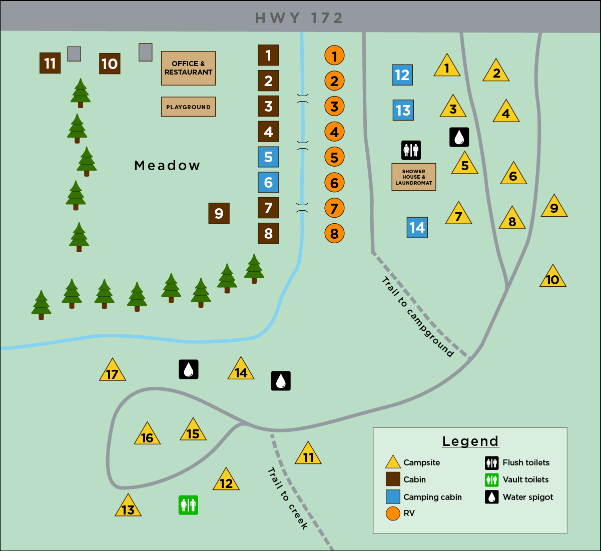
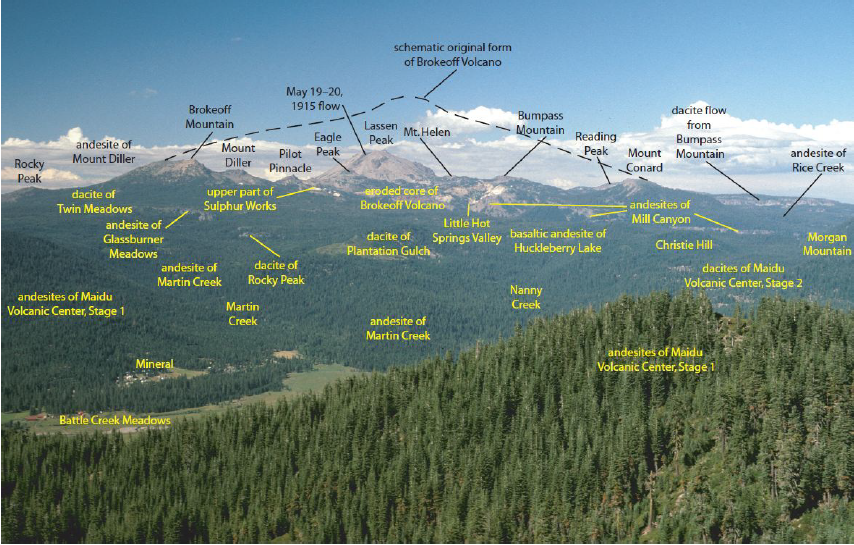

# Mill Creek Campground
You're booked into site # 15 & 16 during May 28th to June 1st 2020 

### Address
`Mill Creek Resort 40271 HWY 172 Mill Creek CA 96061 `
* [🗺 Google Maps](https://www.google.com/maps/place/Mill+Creek+Resort/@40.3236882,-121.5286495,17z/data=!3m1!4b1!4m8!3m7!1s0x809d51687b55c0cd:0x55a8ca806bd13678!5m2!4m1!1i2!8m2!3d40.3236882!4d-121.5264608)
* [🗺 Apple Maps](https://maps.apple.com/?address=40271%20CA-172,%20Mill%20Creek,%20CA%20%2096061,%20United%20States&auid=69099969819570590&ll=40.323330,-121.525710&lsp=9902&q=Mill%20Creek%20Resort&_ext=ChkKBQgEEOIBCgQIBRADCgQIBhALCgQIChAAEiQpxTZOrzkpREAxhel7DcFhXsA59FcjFowpREBBYC7zZ4lhXsA%3D)
* [🌐 Mill Creek Website](https://www.millcreekresort.net/)

> Please be advised that the closest gas is 25 miles from us in the town of Chester.

## Check in details
`Check in any time after 2 PM & check out by 12 PM.`
* Feel free to drive right to your site upon arrival.
* If you plan to arrive late in the evening then please be aware of your neighbors while setting up your site.
* Please park by your campsite.
* Additionally, pets need to be leashed while on the property & picked up after in public areas.

## We Sell (out front by the lodge area)
* ** Wood** ($5 a bundle)
* ** Ice** ($3 a bag).

## Campground Details
* We allow fires in designed fire rings only. Please put your fire dead out when you're away from your site. We ask you kindly to not burn glass bottles & cans.
* The dumpster is located in the main building parking lot.
* Vault toilets are located by sites `#12/#13` in the lower campground.
* Flush toilets & coin operated showers are located behind site #5. (Quarters are available from the grocery store or please bring your own) Toilet paper & soap are provided in the shower house bathrooms.
* Potable water is located by site `#5 & #14` 
* You'll find full services such as a grocery store & more restaurants, as well. Restaurant & convenience store will be CLOSED during your visit.
* If you would like to purchase wood or ice then please leave money in the **Blue Mailbox** by the front door of the lodge. 

If you must use a card then please knock upon arrival & we can assist you. We apologize for the inconvenience this may cause. We live in the main building & can be reached any time of day. Please let us know if you have any concerns or questions. We ask for a one week cancellation before your date of check in to avoid a one night charge of your stay. Additionally, we'll charge your card on file for your reservation. 

Jillian & Joe from Mill Creek Resort 

## Lassen

* [NPS Lassen Conditions](https://www.nps.gov/lavo/planyourvisit/conditions.htm)
* [Lassen Volcanic National Park California](https://www.nps.gov/lavo/planyourvisit/basicinfo.htm)

